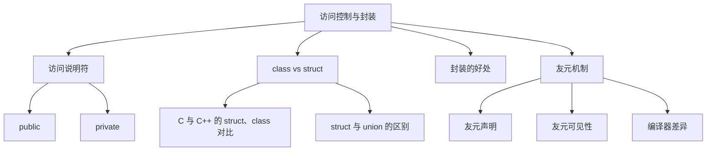

# 📘 7.2 访问控制与封装 (Access Control and Encapsulation)

> 来源说明：C++ Primer 7.2 | 本节涵盖：类的访问控制机制、封装概念及友元函数
> 知识点3、4结合[小林 coding：C++ 面试题](https://www.xiaolincoding.com/interview/cpp.html)中的 struct 相关问答补充，规则参考各知识点中的标准草案。

---

## 🗺️ 知识体系图



## 🧠 核心概念总览

* [*知识点1: 访问说明符*](#id1)：public和private访问控制
* [*知识点2: class与struct的区别*](#id2)：默认访问级别的差异
* [*知识点3: C 的 struct 与 C++ 的 struct、class 对比*](#id3)：成员能力、访问控制、继承与类型名称的使用
* [*知识点4: struct 与 union 的区别*](#id4)：成员存储、大小与使用场景
* [*知识点5: 封装的优势*](#id5)：数据保护和实现灵活性
* [*知识点6: 友元机制*](#id6)：允许非成员函数访问私有成员
* [*知识点7: 友元声明规范*](#id7)：友元的声明和使用规则

---

<a id="id1"></a>
## ✅ 知识点1: 访问说明符

**理论**
* **public说明符**：定义类的接口，所有程序部分都可访问
* **private说明符**：封装类的实现，仅类成员函数可访问
* 同一个访问说明符可以出现次数无限制，可多次出现在类定义中，便于逻辑分组
* 每个访问说明符影响其后成员，直到下一个说明符或类结束

**教材示例代码**
```cpp
class Sales_data {
public:    // 公共接口
    Sales_data() = default;
    Sales_data(const std::string &s, unsigned n, double p):
        bookNo(s), units_sold(n), revenue(p*n) {}
    std::string isbn() const { return bookNo; }
    Sales_data &combine(const Sales_data&);
    
private:   // 私有实现
    double avg_price() const
    { return units_sold ? revenue/units_sold : 0; }
    std::string bookNo;
    unsigned units_sold = 0;
    double revenue = 0.0;
};
```

**注意点**
* ⚠️ 公共成员定义接口，私有成员封装实现细节


---

<a id="id2"></a>
## ✅ 知识点2: `class`与`struct`的区别

**理论**
* **唯一区别**：默认访问级别不同
* **struct**：第一个访问说明符前的成员默认为`public`
* **class**：第一个访问说明符前的成员默认为`private`
* 编程风格约定：全公共成员用`struct`，有私有成员用`class`

**教材示例代码**
```cpp
// 使用struct - 默认public
struct PublicData {
    int x;        // 默认为public
    int y;        // 默认为public
};

// 使用class - 默认private  
class PrivateData {
    int x;        // 默认为private
    int y;        // 默认为private
public:
    // 公共接口...
};
```

**注意点**
* ⚠️ 按照约定选择关键字，提高代码可读性
---

<a id="id3"></a>
## ✅ 知识点3: C 的 struct 与 C++ 的 struct、class 对比

**理论**

- C 的 `struct` 是自定义数据类型，一些变量的集合，用于组合数据
- C++ 的 `struct` 和 `class` 是抽象数据类型，都可以定义类，支持成员函数、构造函数、析构函数、继承等功能。
- C++ 中，`struct` 与 `class` 的区别主要在于**默认成员访问权限和默认继承方式**。[标准规则](https://eel.is/c++draft/class.access)
- 为什么吗有了 `class` 海保留了 `struct`? C++ 是在 C 语言的基础上发展起来的，为了与 C 语言兼容，C++ 中保留了 `struct`

| 对比项 | C 的 `struct` | C++ 的 `struct` | C++ 的 `class` |
|---|---|---|---|
| 成员函数 | 不支持 | 支持 | 支持 |
| 构造函数、析构函数 | 不支持 | 支持 | 支持 |
| 成员访问控制 | 没有访问说明符 | 默认 `public`，可以修改 | 默认 `private`，可以修改 |
| 继承 | 不支持 | 支持，默认 `public` 继承 | 支持，默认 `private` 继承 |
| 定义变量 | 通常写 `struct S obj;` | 可直接写 `S obj;` | 可直接写 `S obj;` |

**注意点**

> ⚠️ C 的结构体可以包含**函数指针成员**，但这不等于支持成员函数。
>
> 💡 C 中可以通过 `typedef` 定义类型别名，从而省略变量声明中的 `struct`。[C 标准示例](https://www.open-std.org/jtc1/sc22/wg14/www/docs/n1570.pdf#page=138)

---

<a id="id4"></a>
## ✅ 知识点4: struct 与 union 的区别

**理论**

- **结构体(struct)**：
    - 普通数据成员各自占用存储空间，可以同时保存各成员的值。
- **联合体(union)**：
    - 成员共享存储空间，同一时刻最多只有一个**活跃成员(active member)**[标准规则](https://eel.is/c++draft/class.union)
    - **同时只有一个成员有效**：
        - 写了一个成员，再读另一个就是"用另一种方式解释同一段字节"
        - 任何时候只有最后写入的那个成员的值是合法的（读其他成员在 C++ 里是 UB，虽然有编译器扩展支持 type punning）
    - **用途**：省内存 + 表达"二选一/多选一"的值。典型场景是网络协议解析、嵌入式、和  `std::variant` 出现之前的多态存储。比如一个 token 要么是数字要么是字符串
    - 现代替代：C++17 之后优先用 `std::variant`，它自带类型安全（知道自己当前存的是哪个），union 是裸的、不安全的

| 对比项 | `struct` | `union` |
|---|---|---|
| 成员存储 | 各自占用空间 | 共享同一块空间 |
| 保存数据 | 多个成员的值可以同时存在 | 同一时刻最多保存一个成员的有效值 |
| 大小 | 容纳各成员，并考虑对齐填充 | 至少容纳最大的成员，并满足对齐要求 |
| 适用场景 | 一组需要同时保存的数据 | 多种数据中只需保存一种，节省空间 |

**示例代码**

```cpp
struct S { int i; double d; };
union U  { int i; double d; };

S s{1, 2.5};  // i 和 d 的值同时存在

U u;
u.i = 1;     // 当前使用 i
u.d = 2.5;   // 改为使用 d，i 不再是活跃成员
```

**注意点**

> ⚠️ 上例写入 `u.d` 后，不能再把 `u.i` 当作有效的整数读取。
>
> 💡 `union` 不会自动记录当前使用哪个成员，通常需要额外的标记来区分。

---

<a id="id5"></a>
## ✅ 知识点5: 封装(encapsulation)的优势

**理论**
* **防止意外破坏**：用户代码**无法**直接修改对象内部状态
* **实现灵活性**：类的内部实现可以改变而**不影响**用户代码，用户代码只在接口改变时才需要修改
* **错误定位**：封装将变化的**影响范围最小化**，bug搜索范围局限于类实现代码
* **维护便利**：只需检查类代码来评估更改影响

**注意点**
* ⚠️ 类定义改变时，使用该类的源文件必须重新编译

---

<a id="id6"></a>
## ✅ 知识点6: 友元机制 (friend)

**理论**
* **友元定义**：允许**其他类或非成员函数**访问类的非公有成员
* **声明位置**：只能在类定义**内部**，使用`friend`关键字
* **访问权限**：友元**不受**其声明位置的访问控制(`public`/`private`)影响
* **最佳实践**：将友元声明集中放在类开头或结尾

**教材示例代码**
```cpp
class Sales_data {
    // 友元声明 - 允许非成员函数访问私有成员
    friend Sales_data add(const Sales_data&, const Sales_data&);
    friend std::istream &read(std::istream&, Sales_data&);
    friend std::ostream &print(std::ostream&, const Sales_data&);
    
public:
    // 公共接口...
private:
    std::string bookNo;
    unsigned units_sold = 0;
    double revenue = 0.0;
};

// 友元函数定义
Sales_data add(const Sales_data&, const Sales_data&);
std::istream &read(std::istream&, Sales_data&);
std::ostream &print(std::ostream&, const Sales_data&);
```

**注意点**
* ⚠️ 友元不是类的成员，不受访问控制约束
* 💡 友元声明只指定访问权限，不是常规函数声明
* 🔄 友元破坏了封装，应谨慎使用

---

<a id="id7"></a>
## ✅ 知识点7: 友元声明规范

**理论**
* **分离声明**：友元声明**仅**提供访问权限，如果想让使用者可以调用这个友元函数需要在**类外单独声明(或实现)函数**
* **头文件位置**：友元函数应在类**同一头文件**中声明
* **编译器差异**：部分编译器不强制要求外部声明，但为可移植性应提供

**注意点**
* ⚠️ 必须提供友元函数的独立声明才能被用户代码调用
* 💡 即使编译器允许，也应提供外部声明以**确保可移植性**
* 🔄 遵循"声明与实现分离"的原则

---

## 🔑 核心要点总结
1. **访问控制**：`public`定义接口，`private`封装实现，保护数据完整性
2. **关键字选择**：C++ 的 `class` 与 `struct` 都支持类的功能，默认成员访问权限和默认继承方式不同；与 C 的 `struct` 的对比见[知识点3](#id3)
3. **封装价值**：提供数据保护、实现灵活性和简化维护
4. **友元机制**：打破封装的特权访问，需要谨慎使用和规范声明
5. **编译依赖**：类定义改变要求重新编译所有使用该类的源文件

## 📌 考试速记版

**访问控制对比表**
| 说明符 | 可访问范围 | 主要用途 |
|--------|------------|----------|
| `public` | 所有代码 | 定义类接口 |
| `private` | 仅类成员函数 | 封装实现细节 |

**`class` vs `struct`**
- **相同点**：功能完全等价
- **不同点**：默认成员访问权限与默认继承方式（class-private, struct-public）

**`struct` vs `union`**
- `struct` 同时保存多个成员的值；`union` 共享存储空间，同一时刻最多只有一个活跃成员。见[知识点4](#id4)。

**友元要点**
- ✅ 声明在类内部，使用friend关键字
- ✅ 需要在类外单独声明函数
- ✅ 不受访问控制区域影响
- ❌ 破坏封装，谨慎使用

**口诀**：*"公接口，私实现，class私来struct公；友元特权破封装，内外声明都要全"*