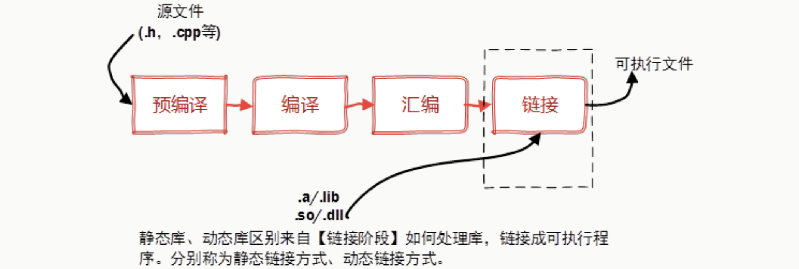
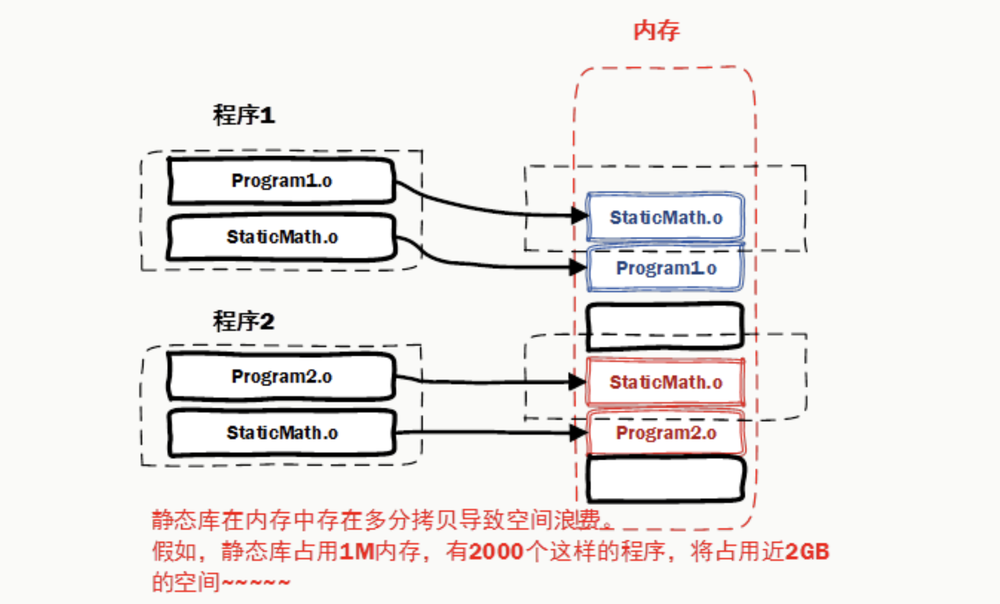
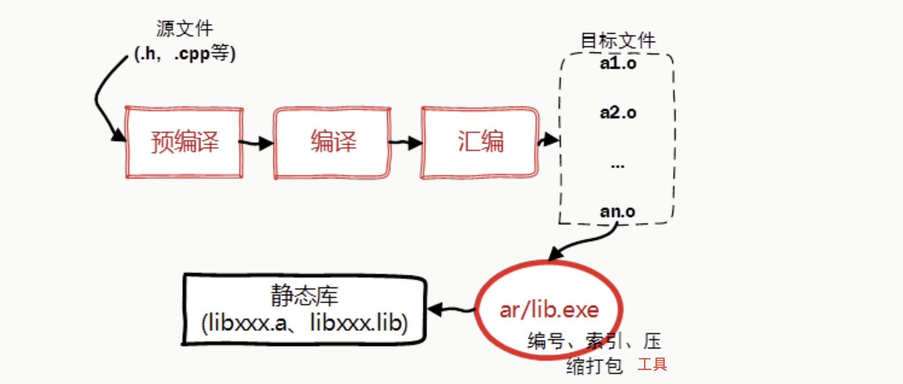
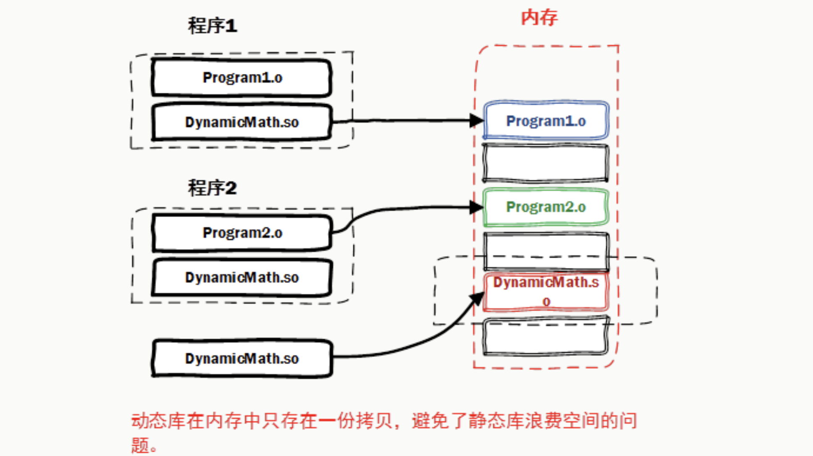

# 📘 [第 17 章] 开发工具 (Dev tools)

> 来源说明：C++ 开发工具链 第 17.1 节 | 本节涵盖：静态库(`.a`)与动态库(`.so`/`.dylib`)的概念、特点、制作、使用及选型原则；CMake 构建系统生成器的核心用法

---

## 🧠 核心概念总览（严格按原文顺序）
- [*知识点1: 库的概念与特点*](#id1)
- [*知识点2: 静态库的概念与特点*](#id2)
- [*知识点3: 静态库的制作与使用*](#id3)
- [*知识点4: 动态库的概念与特点*](#id4)
- [*知识点5: 动态库的制作与使用*](#id5)
- [*知识点6: 静态库与动态库的对比与优先级*](#id6)
- [*知识点7: `CMake` 是什么与为什么需要它*](#id7)
- [*知识点8: `CMakeLists.txt` 基础语法与核心指令*](#id8)
- [*知识点9: 变量与缓存*](#id9)
- [*知识点10: 头文件搜索路径与可见性*](#id10)
- [*知识点11: find_package 引入第三方库*](#id11)
- [*知识点12: 构建流程与构建类型*](#id12)
- [*知识点13: 完整构建实例*](#id13)
- [*知识点14: 进阶——构建配置与目标属性*](#id14)

---
<a id="id1"></a>
## ✅ 知识点 1: 库的概念与特点

**库是什么?**

- 库**是写好的现有的，成熟的，可以复用的代码**
- 现实中每个程序都要依赖很多基础的底层库，不可能每个人的代码都从零开始，因此库的存在意义非同寻常

- 本质上来说库是一种可执行代码的二进制形式，可以被操作系统载入内存执行
    - **库有两种：静态库（.a、.lib）和动态库（.so、.dll）**

    - 所谓静态、动态是指链接，回顾一下，将一个程序编译成可执行程序的步骤：
    


---

<a id="id2"></a>
## ✅ 知识点 2: 静态库的概念与特点

**静态库在编译时将二进制代码链接到目标程序中——启动快，但体积大且更新不便。**

- 静态库(`static library`)是多个目标文件(`.o`)的归档集合
    - 程序在编译时，链接器(`linker`)会把静态库中被用到的函数和类的二进制代码**完整复制**到最终的可执行文件中，这种机制称为静态链接(`static linking`)
    - 运行时不再依赖库文件，可执行文件是自包含的
- **核心问题**：
    1. 由于代码被复制进可执行文件，如果多个程序使用了同一静态库，每个程序的可执行文件中都存在**一份独立的拷贝，造成磁盘空间浪费**
    2. **如果静态库更新了，所有使用它的应用程序都需要重新编译、发布给用户**（对于玩家来说，可能是一个很小的改动，却导致整个程序重新下载，全量更新）
    
- **静态库的核心特点：**
    - **编译时完成链接**，代码已在可执行文件内部，启动和运行时加载速度快
    - **可执行文件体积大**，每个链接了静态库的程序都携带一份独立的库代码
    - **更新和发布不方便**：如果静态库更新了（如修复 bug），所有使用它的程序都需要重新编译并重新发布


> ⚠️ **关键区分**：静态链接的产物是**自包含的**可执行文件——运行时不需要库文件在场，这是它和动态库最本质的区别。
> 💡 **理解技巧**：类比一本书——静态链接像把需要的章节复印下来装订成一本新书，独立完整但厚重。


---

<a id="id3"></a>
## ✅ 知识点 3: 静态库的制作与使用

**制作静态库用 `g++ -c` 编译为 `.a`**

- **文件；使用时通过 `-l库名 -L目录` 链接，库名省略 `lib` 前缀和 `.a` 后缀**
    

- **制作静态库：**
    ```
    g++ -c -o lib库名.a 源代码文件清单
    ```

- **示例/实践**
    ```bash
    # 将 public.cpp 编译为静态库 libpublic.a
    $ g++ -c -o libpublic.a public.cpp
    ```

- **使用静态库：**

    - 不规范的做法——直接写出 `.a` 文件完整路径，把库文件当作普通源文件传入：
        ```
        g++ 选项 源代码文件名清单 lib库名.a
        ```

    - 规范的做法——`-l库名` 指定库（去掉 `lib` 前缀和 `.a` 后缀），`-L目录` 指定搜索路径：
        ```
        g++ 选项 源代码文件名清单 -l库名 -L 库文件所在的目录
        ```
    - **Linux静态库命名规范，必须是 `lib[your_library_name].a`** ：lib为前缀，中间是静态库名，扩展名为.a

- **示例/实践**
    ```bash
    # 不规范做法
    $ g++ -o demo01 demo01.cpp /home/wucz/tools/libpublic.a
    $ ./demo01

    # 规范做法
    $ g++ -o demo01 demo01.cpp -L/home/wucz/tools -lpublic
    ```


> ⚠️ **关键区分**：`-lpublic` 中的 `public` 是去掉 `lib` 前缀和 `.a` 后缀的库名，不是完整文件名。`-L` 告诉编译器"去哪里找"，`-l` 告诉编译器"找哪个"。
> 💡 **理解技巧**：可以把静态库理解为"一堆 `.o` 文件的 zip 包"——编译时解压，把用到的部分拷进可执行文件。
> 🔄 **知识关联**：`-l` / `-L` 模式在动态库中完全一致，是 GCC/G++ 的统一链接接口。

---

<a id="id4"></a>
## ✅ 知识点 4: 动态库的概念与特点

**动态库在运行时才被载入内存，多进程共享同一份代码，节省空间且升级简便。**

- **动态库(`dynamic library` / `shared library`)与静态库相反**：
    
    - 程序在编译时**不会**把库的二进制代码链接到目标程序中，仅在可执行文件中记录"需要哪些动态库的哪些符号"
    - 当程序启动（或运行到需要时），操作系统的动态链接器(`dynamic linker`，Linux 上为 `ld-linux.so`)才将 `.so` 文件载入内存并与程序绑定

- 如果多个进程使用了同一动态库，操作系统通过**虚拟内存机制**使它们在物理内存中共享同一份代码段（但每个进程有独立的数据段），避免空间浪费

- **动态库的核心特点：**

    - **按需载入**：程序运行时需要用到动态库的时候才将其二进制代码载入内存，支持延迟加载(`lazy loading`)
    - **进程间代码共享**：多个进程映射到同一块物理内存页，因此动态库也称为共享库(`shared library`)
    - **升级简单**：不需要重新编译程序，只需要更新 `.so` 文件即可（前提是 ABI 保持兼容）。这让库的发布节奏与应用程序解耦（增量更新）


> ⚠️ **关键区分**：动态库在内存中只有一份**代码段**，但每个进程有自己独立的**数据段**（全局变量等）。这是"共享"的精确边界。
> 💡 **理解技巧**：动态库像一个"公共图书馆"——多个读者可以同时借阅同一本书（共享代码），但每人用自己的笔记本做笔记（独立数据）。
> 🔄 **知识关联**：动态库的编译时链接语法（`-l -L`）与静态库完全相同，区别在于运行时还需要配置库搜索路径（见知识点 5）。


---

<a id="id5"></a>
## ✅ 知识点 5: 动态库的制作与使用

**制作动态库需要 `-fPIC -shared` 选项；使用时编译链接与静态库一致，但运行时需额外配置 `LD_LIBRARY_PATH`**

- **制作动态库：**

    1. `-fPIC` 生成位置无关代码（使库可被加载到内存任意位置，是多进程共享的前提）
    2. `-shared` 指示生成共享库而非可执行文件：

        ```
        g++ -fPIC -shared -o lib库名.so 源代码文件清单
        ```

- **使用动态库——编译时：** 
    1. 与静态库使用相同的 `-l库名 -L目录` 语法：

        ```
        g++ 选项 源代码文件名清单 -l库名 -L 库文件所在的目录
        ```

- **使用动态库——运行时：** 
    1. 动态库的代码不在可执行文件内部，操作系统必须在运行时找到 `.so` 文件
    2. 如果库不在系统默认路径（如 `/usr/lib`），会报错：
        ```
        ./demo01: error while loading shared libraries: libpublic.so:
        cannot open shared object file: No such file or directory
        ```

- 需要通过环境变量 `LD_LIBRARY_PATH` 指定动态库搜索路径：

    ```bash
    export LD_LIBRARY_PATH=$LD_LIBRARY_PATH:库文件所在的目录
    ```

- **示例/实践**
    ```bash
    # 编译
    $ g++ -o demo01 demo01.cpp -L/home/wucz/tools -lpublic

    # 直接运行——报错
    $ ./demo01
    ./demo01: 
    error while loading shared libraries: 
    libpublic.so: cannot open shared object file: No such file or directory

    # 配置搜索路径后——正常运行
    $ export LD_LIBRARY_PATH=$LD_LIBRARY_PATH:/home/wucz/tools
    $ ./demo01
    ```

> ⚠️ **关键区分**：动态库的链接分为**编译时**（`-l` + `-L`）和**运行时**（`LD_LIBRARY_PATH` 或系统默认路径）两个阶段，两者缺一不可。编译时 `-L` 告诉链接器库的位置，运行时 `LD_LIBRARY_PATH` 告诉动态链接器的位置——两条路径是独立的。
> 💡 **理解技巧**：编译通过≠能跑起来，动态库最容易踩的坑就是"编过了但跑不了"——忘了配 `LD_LIBRARY_PATH`。
> 🔄 **知识关联**：macOS 上对应的环境变量是 `DYLD_LIBRARY_PATH`，机制相同但变量名不同。

---

<a id="id6"></a>
## ✅ 知识点 6: 静态库与动态库的对比与优先级

**当静态库和动态库同时存在时，编译器优先使用动态库。两者各有适用场景**

- **优先级规则：** 
    - 如果在 `-L` 指定的目录中同时存在 `libpublic.so` 和 `libpublic.a`，`g++ -lpublic` **默认优先链接动态库版本**，这是 GCC/G++ 的默认行为
    - 如需强制使用静态库，可用 `-static` 选项

- **静态库 vs 动态库 对比：**

    | 维度 | 静态库 (`.a`) | 动态库 (`.so`/`.dylib`) |
    |------|-------------|----------------------|
    | 链接时机 | 编译时 | 运行时 |
    | 代码位置 | 嵌入可执行文件 | 独立文件，运行时加载 |
    | 可执行文件体积 | 大 | 小 |
    | 内存多进程共享 | 否（各有一份拷贝） | 是（共享同一份物理内存） |
    | 启动速度 | 快（无运行时查找开销） | 略慢（需动态链接器介入） |
    | 库更新 | 需重新编译所有依赖程序 | 替换 `.so` 即可（ABI 兼容前提下） |
    | 部署复杂度 | 低（自包含，无外部依赖） | 需管理库搜索路径 |

**注意点**
> ⚠️ **关键区分**：优先动态库是编译器的默认策略，不是语言标准。如果项目同时构建了两个版本，实际生效的是动态版本，需特别留意。
> 💡 **理解技巧**：静态 = 编译时一次性买卖，启动快但胖，改一点全重来。动态 = 运行时按需加载，瘦且共享好升级，但多一步路径配置。没有绝对的好坏，看场景选。
> 🔄 **知识关联**：动态库的 ABI 兼容性是升级的前提——如果新版本改变了函数签名或类布局，仅替换 `.so` 仍会导致运行时错误。

---

<a id="id7"></a>
## ✅ 知识点 7: CMake 是什么与为什么需要它

**CMake 是跨平台的构建系统生成器——它自己不编译代码，而是生成 Makefile 等构建文件，再由对应工具完成编译。**

- 前面的知识点里，制作库、链接库全靠手动敲 `g++` 命令——源文件少时尚可应付
    - 一旦项目有几十上百个源文件、依赖多个库、还要在 Linux/macOS/Windows 上都能构建，手写命令和 Makefile 就会变得极其痛苦
    - CMake 正是为解决这一问题而生

- CMake 是一个**开源的跨平台自动化建构系统**，用来管理软件的构建过程，不依赖于某特定编译器，可支持多层目录、多个应用程序与多个函数库
- **CMake 本身不是构建工具，而是生成构建系统的工具**：它读取 `CMakeLists.txt` 配置文件，自动生成当前平台的构建文件（Makefile、Ninja 构建文件、Visual Studio 工程文件等），真正的编译由 make、ninja、msbuild 这些工具执行
    - **CMakeLists.txt**：CMake 的配置文件，用于定义项目的构建规则、依赖关系、编译选项等；每个 CMake 项目通常包含一个或多个
    - **构建目录**：CMake 鼓励使用独立的构建目录（源外构建 `out-of-source build`），让生成的文件与源代码分开存放，保持源码树整洁

- **CMake 的优势：**
    - **跨平台支持**：同一份构建配置可以在不同操作系统和编译器环境中使用
    - **简化配置**：通过 CMakeLists.txt 定义项目结构、依赖项、编译选项，无需手动编写复杂的构建脚本
    - **自动化构建**：自动检测系统上的库和工具，减少手动配置工作量
    - **灵活性**：支持多种构建类型（Debug、Release），允许自定义构建选项和模块

- **基本工作流程：**
    1. **编写 CMakeLists.txt**：定义项目的构建规则和依赖关系
    2. **生成构建文件**：用 CMake 生成适合当前平台的构建系统文件（如 Makefile）
    3. **执行构建**：用生成的构建文件（make、ninja、msbuild）编译项目


> ⚠️ **关键区分**：CMake ≠ make。CMake 是"写菜谱的"，make 是"炒菜的"——CMake 生成 Makefile，make 按 Makefile 执行编译
> 💡 **理解技巧**：CMake 的价值在于"一份配置，处处构建"——同一份 CMakeLists.txt 在 Linux 生成 Makefile，在 Windows 生成 Visual Studio 工程
> 🔄 **知识关联**：CMake 的 `add_library` 一行就能完成知识点 3、5 中手动制作静态库/动态库的工作（见知识点 8、13）
> 📋 **术语提醒**：构建系统生成器(`build system generator`)、源外构建(`out-of-source build`)

---

<a id="id8"></a>
## ✅ 知识点 8: `CMakeLists.txt` 基础语法与核心指令

**CMakeLists.txt 的语法统一为 `命令名(参数列表)`**

- 最常用的指令只有五个：**版本声明、项目声明、生成可执行文件、生成库、链接库**：
    - `CMakeLists.txt` 是 `CMake` 的核心配置文件，每个 CMake 项目至少需要一个
    - 基本语法格式为 `命令名(参数列表)`，命令不区分大小写，习惯上全小写

- **核心指令：**

    - `cmake_minimum_required(VERSION <版本号>)`：**必须放在文件最顶部**，声明所需的最低 CMake 版本
    - `project(<项目名> [<语言>...])`：定义项目名称和使用的语言（如 `CXX` 表示 C++）
    - `add_executable(<目标名> <源文件>...)`：把源文件编译为可执行文件，目标名就是输出的可执行文件名
    - `add_library(<目标名> [STATIC | SHARED | MODULE] <源文件>...)`：把源文件编译为库——`STATIC` 生成静态库(`.a`/`.lib`)，`SHARED` 生成动态库(`.so`/`.dll`)；不写类型时由 `BUILD_SHARED_LIBS` 变量决定
    - `target_link_libraries(<目标> <库>...)`：把库链接到目标上

- **指定 C++ 标准：**
    ```cmake
    set(CMAKE_CXX_STANDARD 11)          # 使用 C++11
    set(CMAKE_CXX_STANDARD_REQUIRED ON) # 强制要求，不达标就报错而非降级
    ```

- **示例/实践**
    ```cmake
    cmake_minimum_required(VERSION 3.10)        # 最低版本要求，放最顶部
    project(MyProject CXX)                       # 项目名 + 语言为 C++

    set(CMAKE_CXX_STANDARD 17)                   # 使用 C++17 标准
    set(CMAKE_CXX_STANDARD_REQUIRED ON)

    add_library(MyLib STATIC src/mylib.cpp)      # 编译静态库 libMyLib.a
    add_executable(MyApp src/main.cpp)           # 编译可执行文件 MyApp
    target_link_libraries(MyApp PRIVATE MyLib)   # 把 MyLib 链接到 MyApp
    ```

> ⚠️ **关键区分**：`add_library` 不显式给类型时，生成的库类型由 `BUILD_SHARED_LIBS` 决定——同一份 CMakeLists 可能产出静态库也可能产出动态库，要明确就写 `STATIC` 或 `SHARED`。
> 💡 **理解技巧**：每个 `add_executable` 和 `add_library` 都定义了一个**构建目标(`target`)**，后续所有 `target_xxx` 指令都围绕目标展开——这是现代 CMake 的核心思想。
> 🔄 **知识关联**：`add_library(MyLib STATIC ...)` 等价于知识点 3 的 `g++ -c` 打包；`target_link_libraries` 等价于 `-l -L` 链接，但无需手写路径。
> 📋 **术语提醒**：`install()` 指令可定义安装规则（把产物复制到系统目录），入门阶段了解即可。

---

<a id="id9"></a>
## ✅ 知识点 9: 变量与缓存

- **`set()` 定义变量、`${}` 引用变量；CACHE 变量会持久化到 `CMakeCache.txt`，可在命令行用 `-D` 覆盖。**

- **普通变量：** 普通变量在每次 CMake 运行时重新计算，不会持久化
    ```cmake
    set(SRC_LIST main.cpp foo.cpp)    # 定义变量
    add_executable(MyApp ${SRC_LIST}) # 用 ${} 引用
    ```
    作用域为当前目录及其子目录。

- **缓存变量(`cache variable`)：** 让用户在 CMake 配置阶段自定义构建设置，例如开关功能或指定安装路径
    ```cmake
    set(ENABLE_LOGGING ON CACHE BOOL "是否启用日志")
    ```
    - **缓存变量**持久化存储在构建目录的 `CMakeCache.txt` 中，多次 `cmake` 配置之间保持不变
    - 类型有 `STRING`、`BOOL`、`PATH`、`FILEPATH`
    - **可在命令行用 `-D` 覆盖，无需修改 `CMakeLists.txt`**：
        ```bash
        # 在 cmake 命令中通过 -D 修改缓存变量
        $ cmake .. -DMY_INSTALL_PATH=/opt/runoob -DENABLE_LOGGING=OFF
        ```

> ⚠️ **关键区分**：CACHE 变量的默认值**不会自动更新**——如果` CMakeLists.txt` 里改了默认值，已存在的 `CMakeCache.txt` 仍保留旧值。要么删 `CMakeCache.txt`，要么整个删掉 build 目录重新配置。
> 💡 **理解技巧**：CACHE 变量是"用户可调的旋钮"——项目作者在 CMakeLists 里给默认值，使用者在命令行用 `-D` 覆盖，两边都不用改对方的文件。

---

<a id="id10"></a>
## ✅ 知识点 10: 头文件搜索路径与可见性

**优先使用目标级的 `target_include_directories`，用 PRIVATE/PUBLIC/INTERFACE 精确控制头文件路径的传播范围。**

**两种方式对比：**
- `include_directories(<路径>...)`：**全局生效**，当前目录所有目标都受影响——简单粗暴，新项目**不推荐**
- `target_include_directories(<目标> <可见性> <路径>...)`：**只作用于指定目标**——精确可控，现代 CMake 推荐写法

**三种可见性(`scope`)：**
- `PRIVATE`：只有当前目标自己能用
- `PUBLIC`：当前目标和**链接它的目标**都能用（头文件路径会"传递"给消费者）
- `INTERFACE`：只有链接它的目标能用，自己不用——典型场景是纯头文件库(`header-only library`)

**示例/实践**
```cmake
# MyLib 的头文件在 include/ 目录
# PUBLIC：MyLib 自己编译需要，链接 MyLib 的 MyApp 也会自动获得该路径
target_include_directories(MyLib PUBLIC ${PROJECT_SOURCE_DIR}/include)
```

**注意点**
> ⚠️ **关键区分**：`include_directories` 是"大锅饭"，`target_include_directories` 是"按需分配"——后者才能让库的依赖关系清晰可维护。
> 💡 **理解技巧**：PUBLIC 口诀"我用，你也用"——库把自己的 include 路径标记为 PUBLIC，使用者就不用再手动 `-I` 了。这正是对知识点 3、5 中手动头文件管理的自动化。
> 🔄 **知识关联**：同样的 PRIVATE/PUBLIC/INTERFACE 也用于 `target_compile_options`、`target_link_libraries` 等其他 target_xxx 指令（见知识点 14）。

---

<a id="id11"></a>
## ✅ 知识点 11: `find_package` 引入第三方库

**`find_package` 自动在系统中查找已安装的第三方库，配合导入目标一行链接，免去手动指定头文件路径和库路径。**

```cmake
find_package(Boost REQUIRED)                     # 查找 Boost，找不到就报错终止
target_link_libraries(MyApp PRIVATE Boost::Boost) # 链接导入目标
```

- `REQUIRED`：找不到库时配置直接失败（不加则静默继续，需自行检查 `<库名>_FOUND`）
- **现代写法**：链接 `Boost::Boost` 这类**导入目标(`imported target`)**——它自动携带头文件路径、库文件路径等全部信息
- **旧式写法**（不推荐）：手动使用 `${Boost_INCLUDE_DIRS}`、`${Boost_LIBRARIES}` 等变量拼装

**注意点**
> ⚠️ **关键区分**：优先链接 `Boost::filesystem` 这样的导入目标，而不是旧式变量——目标会自动传播头文件路径，变量写法要手动 `include_directories`。
> 💡 **理解技巧**：`find_package` + 导入目标 = 知识点 3、5 中 `-I`、`-L`、`-l` 三个手动步骤的全自动化。
> 🔄 **知识关联**：指定组件查找（`find_package(Boost REQUIRED COMPONENTS filesystem system)`）和非标准路径搜索（`-DBOOST_ROOT=/path`）属于进阶用法，需要时查阅即可。

---

<a id="id12"></a>
## ✅ 知识点 12: 构建流程与构建类型

**标准构建只需四条命令：建目录、配置、编译、运行；`cmake --build .` 是跨平台统一的编译命令。**

**标准构建流程：**
```bash
mkdir build          # 1. 创建独立构建目录（源外构建）
cd build
cmake ..             # 2. 配置：读 CMakeLists.txt，生成 Makefile 等构建文件
cmake --build .      # 3. 编译：调用底层构建工具（跨生成器统一命令）
./MyApp              # 4. 运行
```

清理与重新配置：
```bash
cmake --build . --target clean   # 清理构建产物
cmake .. && cmake --build .      # 修改 CMakeLists.txt 后：重新配置并编译
rm -rf build/*                   # 或者粗暴地清空构建目录
```

**常用配置选项：**
```bash
cmake -G "Ninja" ..                  # 指定生成器（默认 Unix Makefiles）
cmake -DCMAKE_BUILD_TYPE=Release ..  # 指定构建类型
```

**构建类型(`build type`)：**
- `Debug`：关闭优化、带调试符号——开发调试用
- `Release`：开启优化——发布用
- `RelWithDebInfo`：优化 + 保留调试符号
- `MinSizeRel`：最小体积优化

**生成器与产物：** 不同生成器(`generator`)产出不同的构建文件——`Unix Makefiles` 产出 Makefile、`Ninja` 产出 build.ninja、`Visual Studio` 产出 `.sln`。**CMake 负责配置，底层构建系统负责真正的编译。**

底层工具的等价命令（了解即可）：
```bash
make -j$(nproc)     # make 并行编译
ninja               # ninja 编译
```

**注意点**
> ⚠️ **关键区分**：始终使用源外构建——所有生成物放进 `build/` 目录，源码树保持干净；建议把 `build/` 加入 `.gitignore`。
> 💡 **理解技巧**：优先用 `cmake --build .` 而不是直接敲 `make`——它屏蔽了底层工具差异，同一命令在 Makefile、Ninja、VS 工程上都适用。
> 📋 **术语提醒**：`cmake ..` 里的 `..` 是指向**包含顶层 CMakeLists.txt 的源码目录**，不是固定写法。

---

<a id="id13"></a>
## ✅ 知识点 13: 完整构建实例

**一个包含自定义库的最小项目：三个源文件、一份 CMakeLists.txt，走完配置、编译、运行、清理全流程。**

**项目结构：**
```
MyProject/
├── CMakeLists.txt      # 构建规则、目标和依赖关系
├── src/
│   ├── main.cpp        # 入口，含 main()
│   └── mylib.cpp       # 自定义库实现
└── include/
    └── mylib.h         # 库的头文件
```

**完整 CMakeLists.txt：**
```cmake
cmake_minimum_required(VERSION 3.10)              # 最低版本，必须最顶部
project(MyProject VERSION 1.0)                    # 项目名 + 版本号

set(CMAKE_CXX_STANDARD 11)                        # 强制 C++11
set(CMAKE_CXX_STANDARD_REQUIRED ON)

include_directories(${PROJECT_SOURCE_DIR}/include) # 头文件搜索路径

add_library(MyLib src/mylib.cpp)                  # 库目标（未指定类型，由 BUILD_SHARED_LIBS 决定）
add_executable(MyExecutable src/main.cpp)         # 可执行文件目标
target_link_libraries(MyExecutable MyLib)         # 链接库到可执行文件
```

**构建与运行：**
```bash
mkdir build && cd build   # 源外构建目录
cmake ..                  # 配置：检测编译器，生成 Makefile
cmake --build .           # 编译，产出 MyExecutable 和 libMyLib.a
./MyExecutable            # 运行
make clean                # 清理（或 rm -rf build）
```

配置阶段的典型输出：
```
-- The CXX compiler identification is GNU 11.4.0
-- Configuring done
-- Generating done
-- Build files have been written to: /path/to/MyProject/build
```

**注意点**
> ⚠️ **关键区分**：`add_executable`/`add_library` 中的源文件路径是**相对于 CMakeLists.txt 所在目录**的；目标名**大小写敏感**（`MyLib` 和 `mylib` 是两个不同目标）。
> ⚠️ **关键区分**：改了 CMakeLists.txt 要重新 `cmake ..`；只改 `.cpp` 源文件直接 `cmake --build .` 即可。
> 💡 **理解技巧**：对照知识点 3——`add_library(MyLib ...)` + `target_link_libraries(...)` 两行，等价于手动 `g++ -c` 制作库 + `g++ -l -L` 链接的整个流程。这就是 CMake 的价值。
> 🔄 **知识关联**：本例用 `include_directories` 是为了简洁；实际项目应改用知识点 10 的 `target_include_directories(MyLib PUBLIC include)`。

---

<a id="id14"></a>
## ✅ 知识点 14: 进阶——构建配置与目标属性

**不同生成器对构建类型的处理方式不同；以目标为单位用 `target_compile_options` 等命令精细控制编译行为。**

**单配置 vs 多配置生成器：**
- **单配置生成器**（`Unix Makefiles`、`Ninja`）：配置时确定构建类型 `cmake .. -DCMAKE_BUILD_TYPE=Release`，一份 build 目录对应一种类型
- **多配置生成器**（`Visual Studio`、`Xcode`）：配置时不定类型，构建时才选 `cmake --build . --config Release`

**多目标管理：** 一个项目可以定义多个目标，各自设置不同的编译宏和链接库：
```cmake
add_executable(MyApp src/main.cpp)
add_executable(MyTool src/tool.cpp)

target_link_libraries(MyApp PRIVATE MyLib)
target_link_libraries(MyTool PRIVATE MyLib CLI11::CLI11)
```

**目标编译选项（现代推荐写法）：**
```cmake
target_compile_options(MyApp PRIVATE -Wall -Wextra -Wpedantic) # 编译警告选项
target_compile_definitions(MyApp PRIVATE RUNOOB_VERSION="1.0") # 等价于 #define
target_link_options(MyApp PRIVATE -L/usr/local/lib)            # 链接选项
target_compile_features(MyLib PUBLIC cxx_std_17)               # 要求 C++17，PUBLIC 传播给使用者
```

旧式的 `set_target_properties(MyApp PROPERTIES ...)` 也能设置 `COMPILE_OPTIONS`、`COMPILE_DEFINITIONS`、`LINK_FLAGS`、`OUTPUT_NAME` 等属性，但带可见性控制的 `target_xxx` 系列是现代 CMake 的推荐方式。

**注意点**
> ⚠️ **关键区分**：`CMAKE_BUILD_TYPE` 只对单配置生成器有效；多配置生成器要用 `--config`。
> ⚠️ **关键区分**：交叉编译的工具链文件必须在**首次** `cmake` 配置时通过 `-DCMAKE_TOOLCHAIN_FILE=` 指定，切换工具链需清空构建目录（交叉编译细节入门阶段了解即可）。
> 💡 **理解技巧**：凡是想给"某个目标"加选项，就找对应的 `target_xxx` 命令并想清楚用 PRIVATE 还是 PUBLIC——这套思维模式比背命令重要。
> 📋 **术语提醒**：`configure_file()` 可以把 CMake 变量的值注入生成 C++ 头文件（如版本号 `config.h`），需要时查阅即可。

---

## 🔑 核心要点总结

1. **静态库(.a) = 编译时复制**：代码嵌入可执行文件，自包含、启动快，但体积大、更新需全量重编译。
2. **动态库(.so) = 运行时载入**：制作用 `g++ -fPIC -shared`，编译链接用 `-l -L`，运行时配置 `LD_LIBRARY_PATH`。编译通过≠能跑。
3. **内存共享是动态库的核心优势**：多进程共用同一份物理内存中的代码段，各自持有独立数据段。
4. **编译器默认优先动态库**：`.so` 和 `.a` 共存时，`-l` 优先选 `.so`。
5. **核心权衡**：静态 = 部署简单 + 启动快 vs 体积大 + 更新重；动态 = 省空间 + 易升级 vs 运行时依赖 + 需配置路径。
6. **CMake = 构建系统生成器**：读 CMakeLists.txt 生成 Makefile 等构建文件，本身不编译；`add_library` + `target_link_libraries` 替代了手动 `g++ -c` 与 `-l -L`。
7. **标准构建四步**：`mkdir build && cd build → cmake .. → cmake --build .`，坚持源外构建；`-D` 覆盖缓存变量，`-DCMAKE_BUILD_TYPE=` 选 Debug/Release。
8. **现代 CMake 以目标为中心**：优先 `target_xxx` 系列指令 + PRIVATE/PUBLIC/INTERFACE 可见性；第三方库用 `find_package` + 导入目标（如 `Boost::Boost`）。

## 📌 考试速记版

**制作命令对比：**

| | 静态库 | 动态库 |
|---|--------|--------|
| 制作 | `g++ -c -o libxxx.a src.cpp` | `g++ -fPIC -shared -o libxxx.so src.cpp` |
| 使用(编译) | `g++ ... -lxxx -L/path` | 同左 |
| 使用(运行) | 无需额外配置 | `export LD_LIBRARY_PATH=$LD_LIBRARY_PATH:/path` |

**常见陷阱：**
- `-lxxx` 中的 `xxx` 是去掉 `lib` 前缀和扩展名的库名，不是文件名
- 动态库编译通过但运行时 `cannot open shared object file` → 忘配 `LD_LIBRARY_PATH`
- `.so` 和 `.a` 同时存在时默认走动态库，注意确认实际生效的是哪个
- macOS 上动态库是 `.dylib`，环境变量是 `DYLD_LIBRARY_PATH`

**CMake 命令速查：**

| 任务 | 命令/写法 |
|------|----------|
| 最小 CMakeLists.txt | `cmake_minimum_required(VERSION 3.10)` + `project(X CXX)` + `add_executable(app main.cpp)` |
| 生成静态/动态库 | `add_library(lib STATIC/SHARED src.cpp)` |
| 链接库 | `target_link_libraries(app PRIVATE lib)` |
| 标准构建 | `mkdir build && cd build && cmake .. && cmake --build .` |
| 构建类型 | `cmake .. -DCMAKE_BUILD_TYPE=Release` |
| 覆盖缓存变量 | `cmake .. -DVAR=value` |
| 指定生成器 | `cmake .. -G "Ninja"` |
| 引第三方库 | `find_package(Boost REQUIRED)` + `target_link_libraries(app PRIVATE Boost::Boost)` |

**CMake 常见陷阱：**
- 改了 CMakeLists.txt 必须重新 `cmake ..`；只改 `.cpp` 源文件直接 `cmake --build .`
- CACHE 变量改了默认值不生效 → 删 `CMakeCache.txt` 或清空 build 目录
- `cmake ..` 的 `..` 指顶层 CMakeLists.txt 所在的源码目录，不是固定写法
- 目标名**大小写敏感**：`MyLib` 和 `mylib` 是两个目标
- `CMAKE_BUILD_TYPE` 只对单配置生成器（Makefiles/Ninja）有效；VS/Xcode 用 `--config Release`

**记忆口诀**

> 静态编译拷进去，独立快跑体积大；动态运行才加载，共享瘦身易升级。`-l -L` 都一样，动态多配一个 `LD_LIBRARY_PATH`。
>
> CMake 不编译，只生菜谱给 make；`cmake ..` 配 `--build`，目标为王 `target_xxx`。
